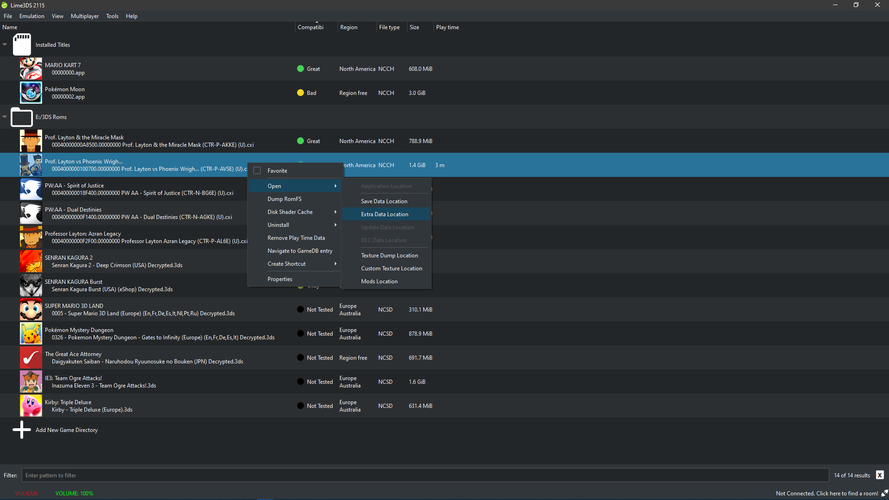
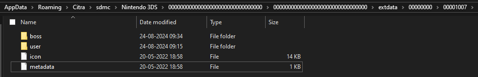
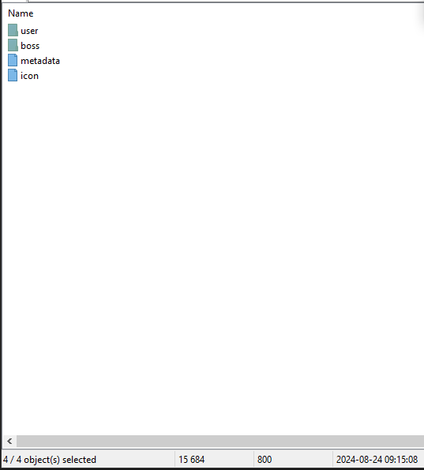
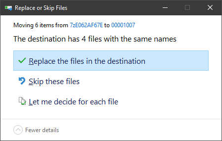
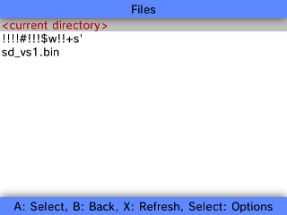
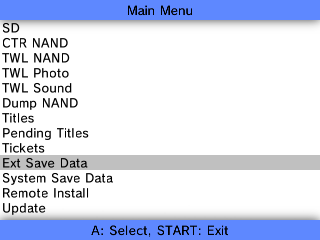
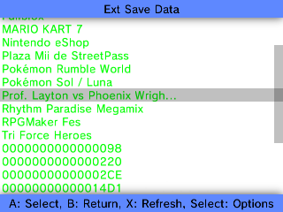
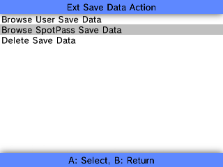
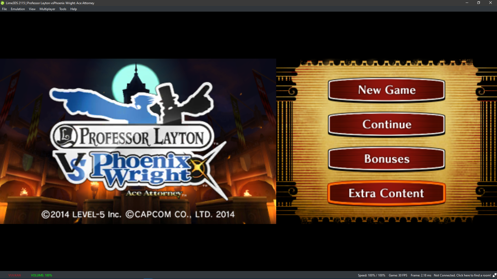

# Professor Layton vs. Phoenix Wright: Ace Attorney DLC Guide

This is a guide for installing the Professor Layton vs. Phoenix Wright: Ace Attorney DLC. This works for the latest releases of the [Azahar](https://azahar-emu.org/) Emulator and on real 3DS Devices.

## Getting the extdata

These are my archives, made from a US Release of the game. When it comes to emulators, these will work for other versions as well. However, for real 3DS devices, the correct version of the spotpass file matters.

EMULATOR: [Archive of extdata](archives/00001007.zip)

REAL 3DS: [Archives of extdata for different versions, organized by version](archives/PLvsAA.zip). Thanks to [patata](https://patataofcourse.github.io/) for providing these.

You can also extract your own data from your 3DS, using FBI and/or checkpoint.  
[This GBATemp Discussion has info on how to get the spotpass data for a file.](https://gbatemp.net/threads/dump-share-your-spotpass-data-for-games.580265/post-9323439)  
[This is the Checkpoint github and has info for how to use it.](https://github.com/BernardoGiordano/Checkpoint)

If you are trying to get the DLC working on a real 3DS, skip to the section after the emulator stuff - the files need to be placed differently. You will need a [hacked 3DS](https://3ds.hacks.guide).

## Adding the extdata - Emulator

Launch Azahar. Note that screenshots were taken from lime3DS, but the same process follows for Azahar.

Open your extdata folder from the right click context menu of the game as shown.

- Right click the game in the home menu, and then select
Open. Then select Extra Data Location from the second menu that opens.
This should open the extdata folder in the file explorer.

- This shows the contents of the azahar extdata folder for the game.

**Replace** the contents of this folder with the contents of the archive you downloaded.
 

- Images showing the contents of the zip files and that you should
choose replace files with the dialog prompt that shows up

### For users with their own data

If you manually extracted your spotpass and extdata, then the spotpass archive's file (`!!!!#!!!$w!!+s'`) goes in `boss`, and the `sd_vs1.bin` file goes in the `save` folder.

## Process for real 3DS devices

1. You need a completed save file for VS, because the game will not allow you to unlock extra content until you have at least one save file as such. This is indicated by a silver or gold (for perfect picarats) icon on the save file, with Layton and Phoenix both pointing towards you. Additionally as mentioned in the top section, you need a hacked 3DS, and the homebrew utility FBI.

2. Copy the folder for your version of the game from the extdata archive to your 3DS SD card.

3. Assuming you have one now, you need to open the game, go to extra content, open your completed save file, then select unlock content. You do not need a setup such as pretendo for this, but you should be connected to the internet. This should create dummy extra data. You can cancel the download at this step, AFTER it says "creating extra data...", as it will not succeed and waiting will only waste your time. (Optimally you cancel as soon as the "downloading" progress bar starts going up).

4. Close the game. Open FBI, choose the first option "SD" and navigate to the folder with the DLC files for your game that you stored in step 2. Select `sd_vs1.bin` with `A`, and then select Copy. 

5. Navigate backwards through the menu to the home of the FBI app.   This time, choose "Ext Save Data", and then after waiting for it to load, navigate to Layton vs Ace Attorney  and then press `A`. Select "Browse User Save Data", then select "&lt;current directory&gt;", then Paste.

6. Now, we have to go all the way back to the root folder and find the DLC files as with step 4. This time, choose the other file with symbols in the name (`!!!!#!!!$w!!+s'`), press `A` and select `Copy`.

7. Like with step 5, navigate back to the home, choose Ext Save Data, load Layton vs Ace Attorney. This time, choose "Browse SpotPass Save Data". Select "&lt;current directory&gt;", then Paste.

8. Close FBI, and open PLvsPWAA. If you have done everything correctly, you should be able to run the DLC by opening Extra content on the completed save file.

## Running the DLC

Once the extdata is added, if you have a completed game save file, you should be able to access the extra content of the game. To do this from the home menu, select extra content, and if the loading does not crash, you should see the next menu for viewing either the special episodes or the special gallery.  

## Acknowledgements

- A huge thanks to the Citra and now Azahar teams for implementing the emulator that makes it possible to still play this game, and thanks to [Rokkubro](https://github.com/Rokkubro) for implementing the changes necessary to make it possible for the DLC to work on Citra and it's successor Azahar.
- Thanks to [patata](https://patataofcourse.github.io/blog/layton-vs-aa/) for figuring out how to make the DLC work for real 3DS devices, since the solution here didn't quite work for real devices since the network shutdown. They have a really cool article on their deep dive into the process of getting it to work, so please check it out!
