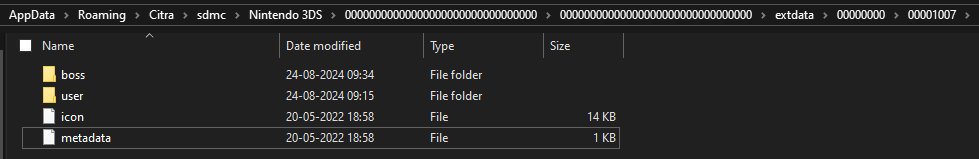
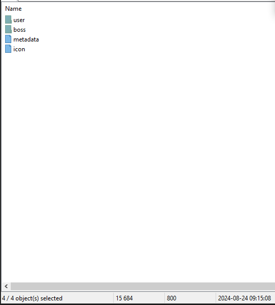
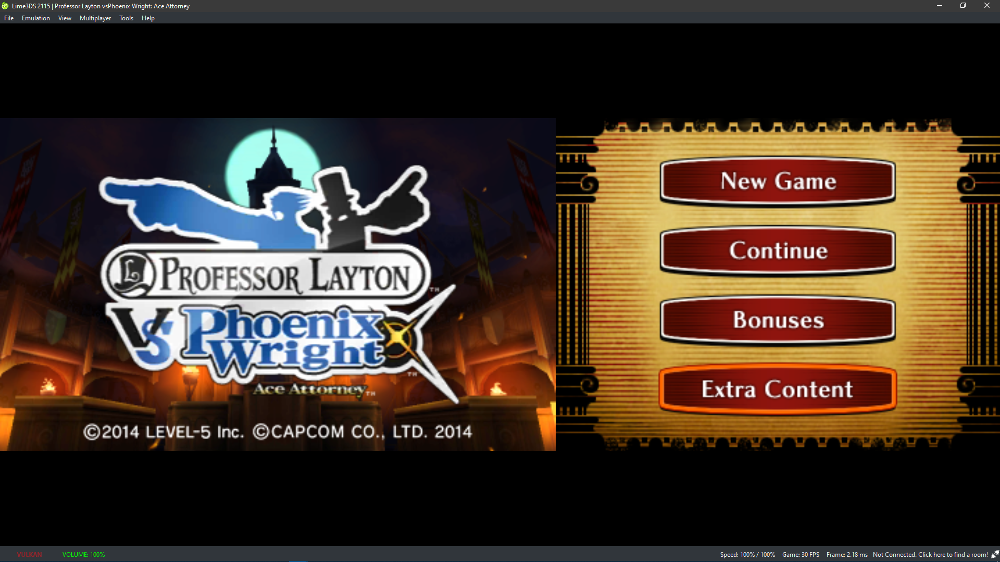

# Professor Layton vs. Phoenix Wright: Ace Attorney DLC Guide

This is a guide for installing the Professor Layton vs. Phoenix Wright: Ace Attorney DLC. This works on the latest releases of [Lime 3DS](https://lime3ds.github.io/) and [PabloMK7/Citra](https://github.com/PabloMK7/citra/releases) forks.

## Getting the extdata

These are my archives, made from a US Release of the game. However I cross checked with a friend with an EU copy, and the same files were present, so it should work.

[7z archive of extdata](archives/00001007.7z) [zip archive of extdata](archives/00001007.zip)

You can also extract your own data from your 3DS, using FBI and/or checkpoint.  
[This GBATemp Discussion has info on how to get the spotpass data for a file.](https://gbatemp.net/threads/dump-share-your-spotpass-data-for-games.580265/post-9323439)  
[This is the Checkpoint github and has info for how to use it.](https://github.com/BernardoGiordano/Checkpoint)

## Adding the extdata

Launch your Citra fork - must be one of the newer releases - tested on lime3ds 2115 and PabloMK7/Citra release 518f723.

Open your extdata folder from the right click context menu of the game as shown.

- Right click the game in the citra fork's home menu, and then select
Open. Then select Extra Data Location from the second menu that opens.
This should open the extdata folder in the file explorer.

- This shows the contents of the citra extdata folder for the game.

**Replace** the contents of this folder with the contents of the archive you downloaded.
 

- Images showing the contents of the zip/7z files and that you should
choose replace files with the dialog prompt that shows up

### For users with their own data

If you manually extracted your spotpass and extdata, then the spotpass archive's file (which for me has a name made of special characters, and no extension) goes in `boss`, and the `sd_vs1.bin` file goes in the `save` folder.

## Running the DLC

Once the extdata is added, if you have a completed game save file, you should be able to access the extra content of the game. To do this from the home menu, select extra content, and if the loading does not crash, you should see the next menu for viewing either the special episodes or the special gallery.  

### Troubleshooting

WIP

Enjoy :3
